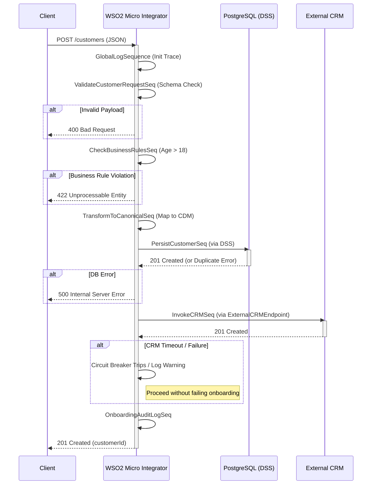

# Customer Onboarding Flow

## VETO Pattern Overview

The Customer Onboarding process follows the VETO (Validate, Extract, Transform, Operate) Enterprise Integration Pattern.

```mermaid
sequenceDiagram
    participant Client
    participant WSO2_MI as WSO2 Micro Integrator
    participant DB as PostgreSQL (DSS)
    participant CRM as External CRM

    Client->>WSO2_MI: POST /customers (JSON)
    activate WSO2_MI
    
    WSO2_MI->>WSO2_MI: GlobalLogSequence (Init Trace)
    WSO2_MI->>WSO2_MI: ValidateCustomerRequestSeq (Schema Check)
    alt Invalid Payload
        WSO2_MI-->>Client: 400 Bad Request
    end
    
    WSO2_MI->>WSO2_MI: CheckBusinessRulesSeq (Age > 18)
    alt Business Rule Violation
        WSO2_MI-->>Client: 422 Unprocessable Entity
    end
    
    WSO2_MI->>WSO2_MI: TransformToCanonicalSeq (Map to CDM)
    
    WSO2_MI->>DB: PersistCustomerSeq (via DSS)
    activate DB
    DB-->>WSO2_MI: 201 Created (or Duplicate Error)
    deactivate DB
    alt DB Error
        WSO2_MI-->>Client: 500 Internal Server Error
    end
    
    WSO2_MI->>CRM: InvokeCRMSeq (via ExternalCRMEndpoint)
    activate CRM
    CRM-->>WSO2_MI: 201 Created
    deactivate CRM
    alt CRM Timeout / Failure
        WSO2_MI->>WSO2_MI: Circuit Breaker Trips / Log Warning
        Note right of WSO2_MI: Proceed without failing onboarding
    end
    
    WSO2_MI->>WSO2_MI: OnboardingAuditLogSeq
    
    WSO2_MI-->>Client: 201 Created (customerId)
    deactivate WSO2_MI
```
