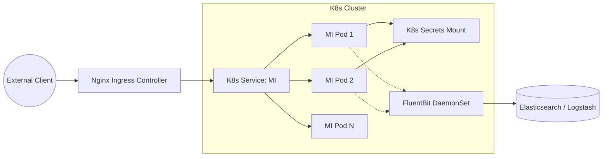

# Deployment Architecture

The Enterprise Integration Hub is designed for a cloud-native Kubernetes deployment.

## Kubernetes Deployment Diagram

## Key Principles
1. **Stateless Nodes**: All WSO2 MI pods are perfectly stateless. Any required state (like caching) is offloaded to a distributed cache (e.g., Redis).
2. **Immutable Infrastructure**: Configuration is baked into the Docker image, parameterized via environment variables injected by Kubernetes Secrets.
3. **Log Aggregation**: MI outputs JSON logs to `stdout`. FluentBit or Promtail running as a DaemonSet captures these logs and forwards them to a centralized observability stack.
