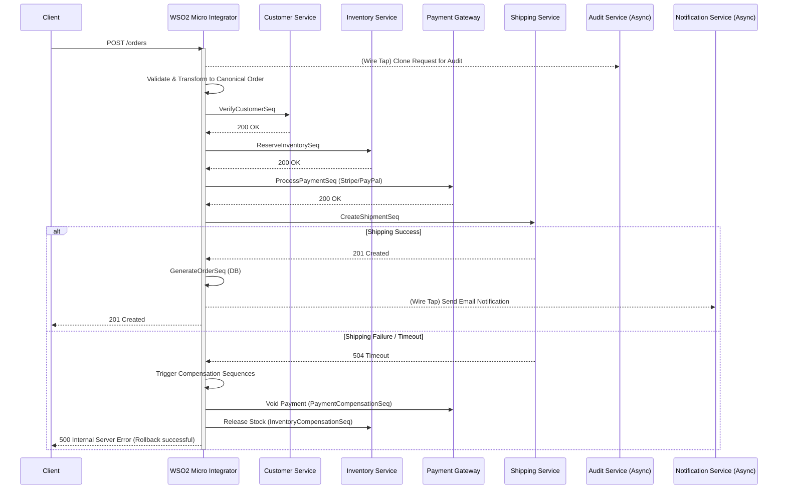

# Order Processing Orchestration Flow

## Architecture Overview

This diagram illustrates the complex orchestration handled by WSO2 Micro Integrator during Order Processing. It utilizes several Enterprise Integration Patterns (EIP):
- **Wire Tap**: Asynchronous audit logging and email notifications.
- **Content-Based Routing**: Routing payments to Stripe vs PayPal based on request details.
- **Saga Compensation**: Rolling back inventory and payment if shipping fails.

