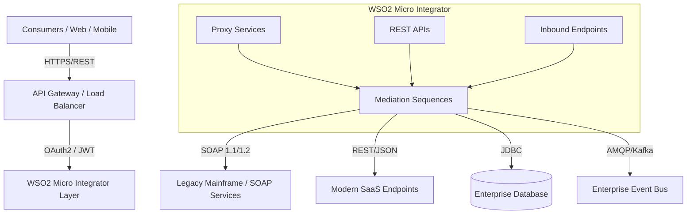

# System Architecture

The Enterprise Integration Hub acts as the centralized mediation layer for the entire organization.

## Architecture Diagram

## Layers Explained
1. **Presentation Layer (Consumers)**: Clients connecting over standard protocols (HTTP/REST).
2. **Gateway / Security**: Handles API Lifecycle, throttling, and initial token verification. 
3. **Integration Layer (WSO2 MI)**:
   - **Proxy Services**: Used for SOAP-to-REST or routing.
   - **REST APIs**: Native RESTful endpoint definitions.
   - **Sequences**: The core business logic of integration (transformation, filtering, cloning).
4. **Backend Services**: The diverse ecosystem of the enterprise.
