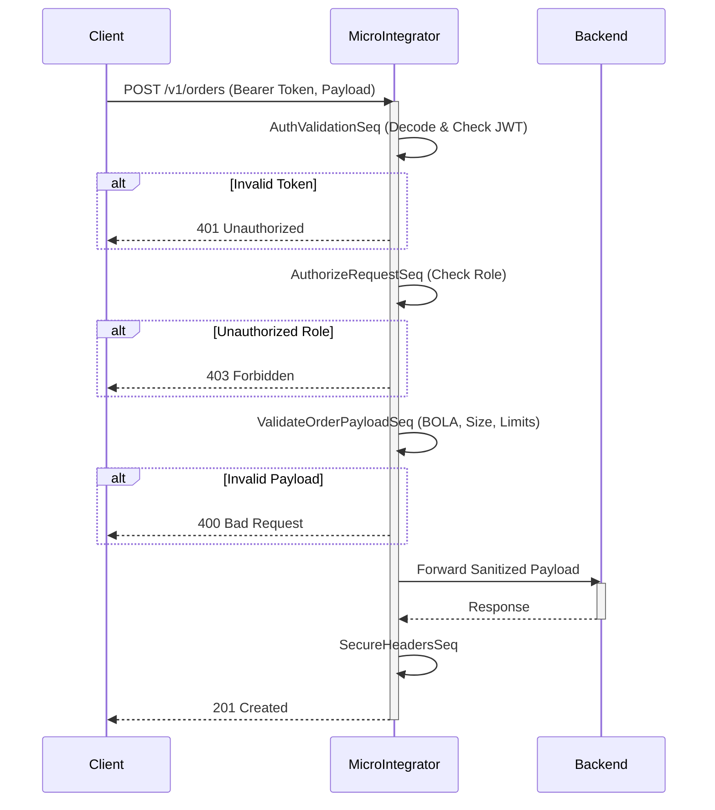

# Security Architecture

This document describes the Enterprise Security Architecture implemented for the WSO2 Micro Integrator deployment.

## Overview
The architecture strictly follows Secure by Design, Defense in Depth, and Zero Trust principles.

### Key Components

1. **Authentication (AuthValidationSeq.xml)**
   - Extracts and decodes JWT `Bearer` tokens.
   - Validates `exp` (expiration).
   - Extracts `sub` (subject) and `roles`.

2. **Authorization (AuthorizeRequestSeq.xml)**
   - Role-Based Access Control (RBAC).
   - Enforces specific roles for specific APIs (e.g., `admin` for Customer Onboarding, `user` for Order Processing).

3. **Input & Payload Security**
   - Limits payload sizes to mitigate Denial of Service.
   - Strictly enforces `Content-Type: application/json`.
   - Validates string lengths to prevent Buffer Overflow and NoSQL/SQL injections.
   - Mitigates Mass Assignment by only extracting known properties.
   - Prevents Broken Object Level Authorization (BOLA) by ensuring the JWT subject matches the requested operation target.

4. **Transport Security & Headers (SecureHeadersSeq.xml)**
   - Enforces HSTS.
   - Disables Content Sniffing (`X-Content-Type-Options`).
   - Mitigates Clickjacking (`X-Frame-Options`).

5. **Audit Logging & Error Handling**
   - Correlates all requests via `X-Correlation-ID`.
   - Strips sensitive stack traces from fault responses using RFC 7807 Problem Details.
   - Logs authenticated user identities.

## Architecture Flow

